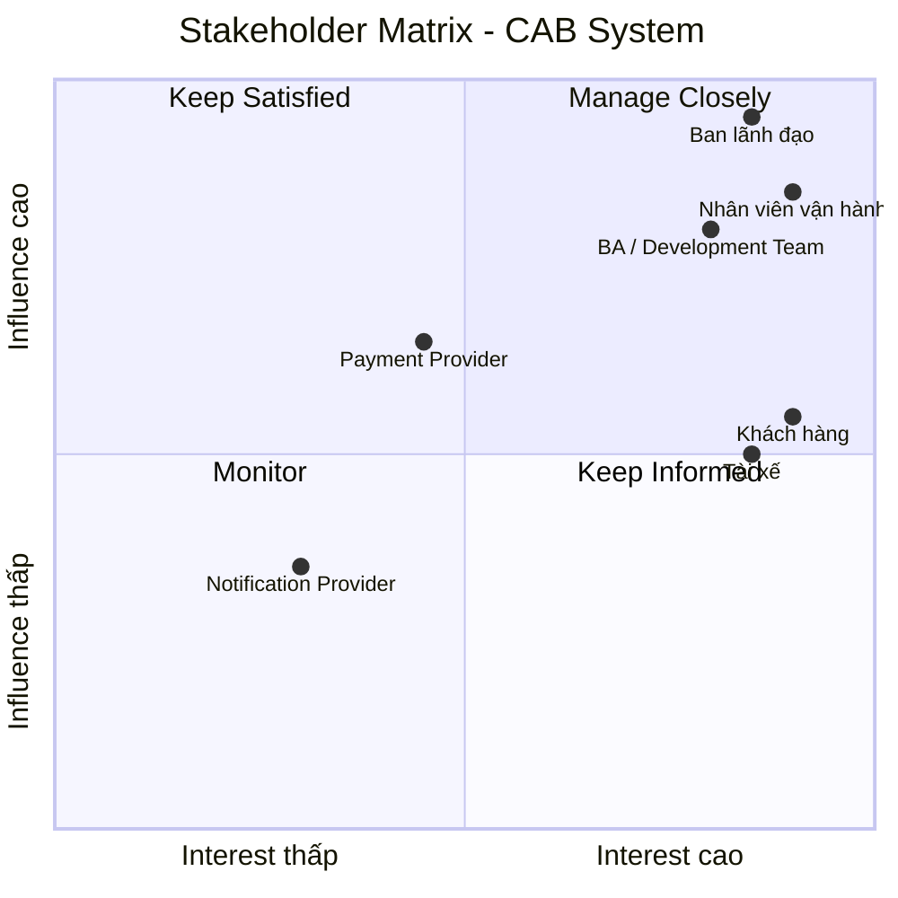
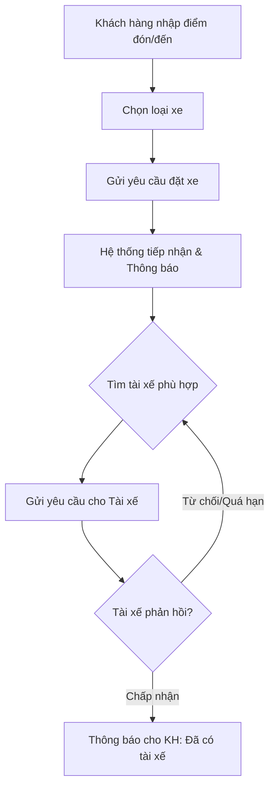
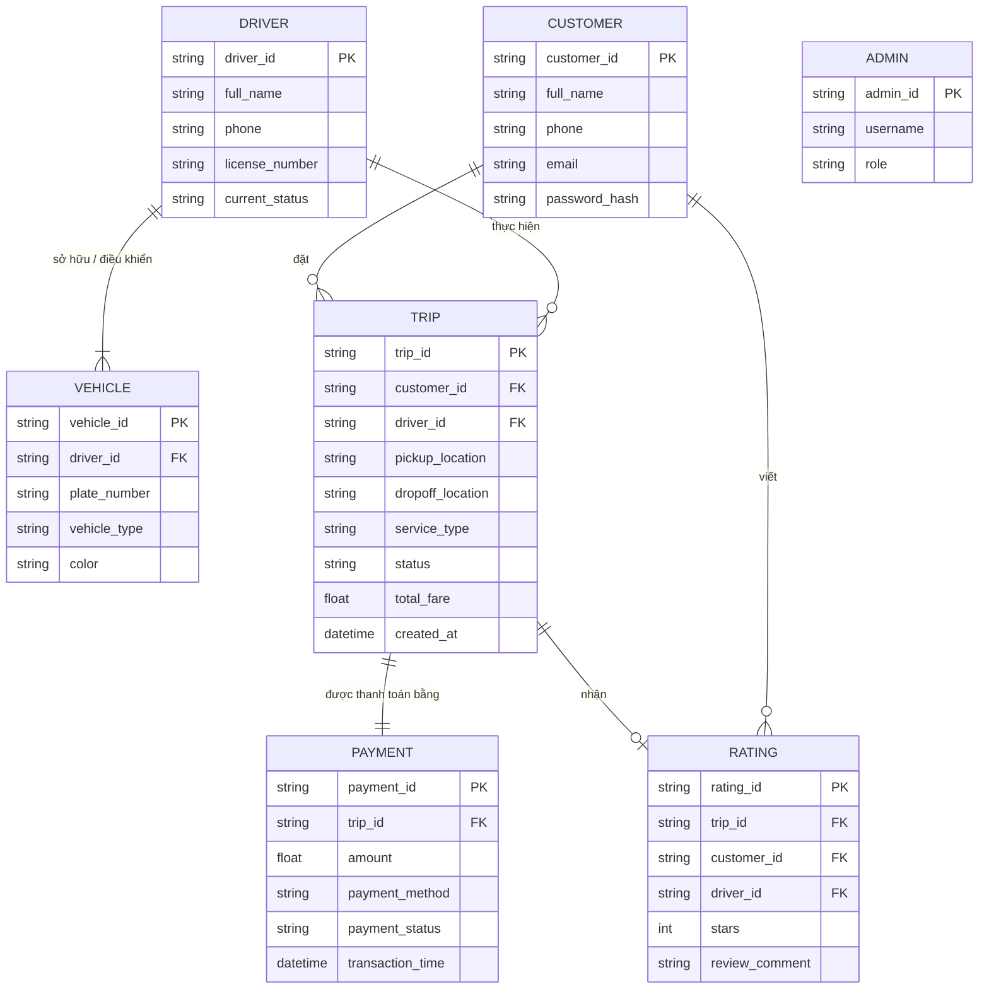
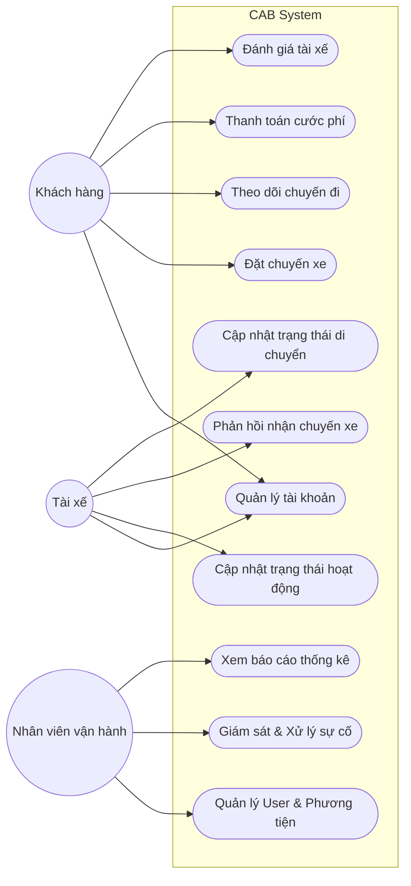

# PHÂN TÍCH YÊU CẦU DỰ ÁN: CAB SYSTEM

## B1. Đọc và phân tích yêu cầu sơ bộ của khách hàng

### 1. Tổng quan Business
*   **Doanh nghiệp:** Công ty ABC[cite: 1]
*   **Dự án:** CAB System – Nền tảng đặt xe[cite: 1]
*   **Mục tiêu:** Xây dựng một nền tảng đặt xe mới có khả năng phục vụ số lượng lớn khách hàng và tài xế, đồng thời có kiến trúc linh hoạt để mở rộng trong tương lai[cite: 1].

### 2. Business Problem (Vấn đề nghiệp vụ)
Các vấn đề về phân công tài xế, theo dõi chuyến, thanh toán và vận hành được nêu trực tiếp trong yêu cầu của khách hàng[cite: 1]:

| Vấn đề hiện tại | Ảnh hưởng đến Business | Nhu cầu của hệ thống mới |
| :--- | :--- | :--- |
| Phân công tài xế chủ yếu thủ công[cite: 1] | Chậm, tốn nhân lực, khó mở rộng | Tự động tìm và phân công tài xế[cite: 1] |
| Khách hàng khó theo dõi chuyến đi[cite: 1] | Trải nghiệm khách hàng kém | Theo dõi trạng thái chuyến theo thời gian[cite: 1] |
| Thanh toán chưa được quản lý tập trung[cite: 1] | Khó kiểm soát giao dịch | Tích hợp hệ thống tính cước và thanh toán[cite: 1] |
| Vận hành khó mở rộng[cite: 1] | Khi lượng người dùng tăng, dễ quá tải | Kiến trúc có khả năng mở rộng (scale)[cite: 1] |
| Xử lý khi tài xế từ chối còn hạn chế[cite: 1] | Làm gián đoạn yêu cầu đặt xe | Tự động tìm tài xế tiếp theo[cite: 1] |
| Chưa có đầy đủ quy tắc nghiệp vụ[cite: 1] | Developer chưa đủ thông tin xây dựng | BA phải làm rõ với các Stakeholder[cite: 1] |
| Chức năng thanh toán/thông báo có thể ảnh hưởng toàn hệ thống[cite: 1] | Một lỗi có thể làm gián đoạn dịch vụ | Các component hoạt động và mở rộng độc lập[cite: 1] |

### 3. Business Objective (Mục tiêu nghiệp vụ)
Từ yêu cầu, có thể xác định các mục tiêu business chính:
*   Tự động hóa quy trình đặt xe và phân công tài xế[cite: 1].
*   Nâng cao trải nghiệm khách hàng bằng việc cho phép theo dõi chuyến đi[cite: 1].
*   Quản lý tập trung việc tính cước và thanh toán[cite: 1].
*   Hỗ trợ vận hành thông qua hệ thống quản trị[cite: 1].
*   Có khả năng mở rộng khi số lượng người dùng tăng[cite: 1].
*   Đảm bảo bảo mật dữ liệu khách hàng, tài xế, phương tiện, vị trí và giao dịch[cite: 1].
*   Hỗ trợ phát triển lâu dài, có thể thêm dịch vụ, phương thức thanh toán và nhà cung cấp thông báo mới[cite: 1].

### 4. Ai sẽ sử dụng hệ thống?
Tài liệu xác định 3 nhóm người dùng chính trực tiếp sử dụng hệ thống: khách hàng, tài xế và nhân viên vận hành[cite: 1]. 

| User | Mục đích sử dụng | Các chức năng chính |
| :--- | :--- | :--- |
| **Khách hàng** (Customer) | Đặt và theo dõi xe[cite: 1] | Đăng ký/đăng nhập, cập nhật thông tin, đặt xe, chọn loại xe, theo dõi chuyến, xem lịch sử, thanh toán, đánh giá tài xế[cite: 1] |
| **Tài xế** (Driver) | Nhận và thực hiện chuyến[cite: 1] | Quản lý hồ sơ/phương tiện, cập nhật trạng thái hoạt động, nhận/từ chối chuyến, cập nhật trạng thái chuyến, cung cấp vị trí[cite: 1] |
| **Nhân viên vận hành** (Operator) | Quản lý, xử lý hoạt động hệ thống[cite: 1] | Quản lý khách hàng/tài xế/phương tiện/chuyến đi, xử lý sự cố, xem giao dịch, theo dõi tài xế[cite: 1] |

> **Lưu ý:** Ngoài ba nhóm sử dụng trực tiếp, hệ thống còn có Ban lãnh đạo, Nhà cung cấp thanh toán bên ngoài và Nhà cung cấp dịch vụ thông báo là những bên liên quan quan trọng[cite: 1].

---

## B2. Xác định Stakeholder (Các bên liên quan)

### 1. Cách xác định Stakeholder
Sau khi hiểu business context, BA xác định stakeholder dựa trên các câu hỏi:
*   Ai sử dụng trực tiếp hệ thống?
*   Ai ra quyết định hoặc sở hữu business?
*   Ai quản lý/vận hành hệ thống?
*   Ai cung cấp dịch vụ tích hợp cho hệ thống?
*   Ai chịu ảnh hưởng bởi kết quả của hệ thống?
*   Ai có quyền quyết định hoặc ảnh hưởng đến yêu cầu?

### 2. Bảng 1: Xác định Stakeholder
Tài liệu đặc biệt yêu cầu BA phải làm rõ các vấn đề chưa được chốt với các stakeholder trước khi nhóm phát triển xây dựng giải pháp[cite: 1].

| STT | Stakeholder | Phân loại | Tương tác trực tiếp? | Mối quan tâm chính |
| :--- | :--- | :--- | :--- | :--- |
| 1 | **Khách hàng** (Customer) | Primary User | Có | Đặt xe nhanh, theo dõi chuyến, thanh toán, trải nghiệm tốt[cite: 1] |
| 2 | **Tài xế** (Driver) | Primary User | Có | Nhận chuyến phù hợp, cập nhật trạng thái, quản lý phương tiện[cite: 1] |
| 3 | **Nhân viên vận hành** (Operator) | Internal User | Có | Quản lý khách hàng, tài xế, chuyến đi và xử lý sự cố[cite: 1] |
| 4 | **Ban lãnh đạo** (Management) | Business Stakeholder | Gián tiếp | Doanh thu, số chuyến, tỷ lệ hoàn thành/hủy, hiệu quả tài xế, khả năng mở rộng[cite: 1] |
| 5 | **NCC thanh toán** (Payment Provider) | External Stakeholder | Qua API | Xử lý thanh toán điện tử an toàn[cite: 1] |
| 6 | **NCC thông báo** (Notification Provider)| External Stakeholder | Qua API | Gửi thông báo cho khách hàng và tài xế[cite: 1] |
| 7 | **BA / Development Team** | Project Stakeholder | Có | Làm rõ yêu cầu, xây dựng và triển khai hệ thống[cite: 1] |

### 3. Bảng 2: Vai trò của Stakeholder

| Stakeholder | Vai trò trong hệ thống | Quyền lợi / Nhu cầu | Mức ảnh hưởng |
| :--- | :--- | :--- | :--- |
| **Khách hàng** | Người tạo yêu cầu đặt xe và sử dụng dịch vụ[cite: 1] | Đặt xe, biết trạng thái tài xế, thanh toán, đánh giá[cite: 1] | Cao |
| **Tài xế** | Người nhận và thực hiện chuyến[cite: 1] | Nhận chuyến phù hợp, quản lý trạng thái, phương tiện[cite: 1] | Cao |
| **Nhân viên vận hành**| Quản lý hoạt động hằng ngày[cite: 1] | Theo dõi chuyến, tài xế, khách hàng, xử lý lỗi[cite: 1] | Rất cao |
| **Ban lãnh đạo** | Chủ sở hữu business / Người ra quyết định[cite: 1] | Doanh thu, hiệu quả vận hành, báo cáo, khả năng mở rộng[cite: 1] | Rất cao |
| **Payment Provider** | Xử lý giao dịch thanh toán điện tử[cite: 1] | Giao tiếp chính xác qua API (Không lưu thông tin nhạy cảm trên CAB)[cite: 1] | Trung bình – Cao |
| **Notification Provider**| Cung cấp kênh gửi thông báo[cite: 1] | Gửi thông báo ổn định, có khả năng mở rộng[cite: 1] | Trung bình |
| **BA / Dev Team** | Phân tích và xây dựng giải pháp[cite: 1] | Yêu cầu rõ ràng, business rule đầy đủ, kiến trúc phù hợp[cite: 1] | Cao |

### 4. Stakeholder Matrix (Ma trận quyền lực/Sự quan tâm)

Việc phân loại dựa trên ma trận **Power/Influence – Interest** giúp xác định stakeholder nào cần được ưu tiên:

*   🔴 **Manage Closely (Quản lý chặt):** Ban lãnh đạo, Nhân viên vận hành, BA / Development Team. Nhóm này cần trao đổi thường xuyên vì ảnh hưởng lớn đến phạm vi, quy tắc nghiệp vụ và cách hệ thống được xây dựng.
*   🟡 **Keep Informed / Engage Closely (Thông tin thường xuyên):** Khách hàng, Tài xế. Nhóm có mức độ sử dụng hệ thống rất cao, ảnh hưởng trực tiếp đến chức năng cốt lõi.
*   🟠 **Manage Contract / Integration (Quản lý tích hợp):** Payment Provider. Ảnh hưởng đáng kể đến chức năng thanh toán qua API.
*   🟢 **Monitor (Giám sát):** Notification Provider. Ảnh hưởng đến một phần hệ thống nhưng không quyết định trực tiếp business process.

#### Sơ đồ Ma trận (Mermaid)

*(Lưu ý: Vị trí trong matrix được suy ra từ chức năng, trách nhiệm và các yêu cầu business trong tài liệu)*.

---

## B3. Mục tiêu nghiệp vụ (Business Goals)

Dưới đây là danh sách các Mục tiêu nghiệp vụ được thiết kế và trích xuất từ yêu cầu của dự án:

*   **BG1: Tự động hóa và tối ưu hóa quy trình phân công tài xế.** Tự động xác định tài xế phù hợp, ưu tiên tài xế gần nhất và tự động tìm tài xế khác nếu bị từ chối mà không bắt khách hàng tạo lại yêu cầu[cite: 1].
*   **BG2: Nâng cao tính minh bạch và trải nghiệm theo dõi cho khách hàng.** Cung cấp thông tin cập nhật liên tục: thời điểm tìm tài xế, nhận chuyến, thời gian dự kiến đến và trạng thái di chuyển hiện tại[cite: 1].
*   **BG3: Quản lý thanh toán tập trung, đa dạng và bảo mật.** Tính cước tự động dựa trên loại dịch vụ, tích hợp thanh toán điện tử qua bên thứ 3 và không lưu thông tin thẻ trực tiếp trên nền tảng CAB[cite: 1].
*   **BG4: Nâng cao năng lực và hiệu quả quản trị vận hành.** Xây dựng giao diện quản trị phân quyền cho phép tra cứu lịch sử, hỗ trợ xử lý lỗi và cung cấp báo cáo (doanh thu, tỷ lệ hoàn thành, hiệu quả hoạt động)[cite: 1].
*   **BG5: Đảm bảo độ ổn định hệ thống và khả năng chịu tải.** Các thành phần của hệ thống mở rộng độc lập, đảm bảo lỗi ở một module (thanh toán/thông báo) sẽ không làm toàn bộ hệ thống ngừng hoạt động[cite: 1].
*   **BG6: Xây dựng kiến trúc nền tảng linh hoạt, hướng tới tương lai.** Linh hoạt bổ sung dịch vụ mới, phương thức thanh toán hoặc nhà cung cấp thông báo mà không cần xây dựng lại từ đầu[cite: 1].
*   **BG7: Đáp ứng thời gian tiếp cận thị trường (Time-to-market).** Toàn bộ nền tảng CAB mới phải được xây dựng và triển khai trong 7 tuần[cite: 1].

---

## B4. Phạm vi dự án (Project Scope)

### 1. Những giới hạn và các tính năng KHÔNG NÊN LÀM (Out-of-Scope / Constraints)
Trong khuôn khổ dự án CAB System hiện tại, đội ngũ dự án **tuyệt đối không thực hiện** các hạng mục sau:

1.  **Không tự xây dựng cổng thanh toán riêng:** Phải tích hợp với một nhà cung cấp thanh toán bên ngoài[cite: 1].
2.  **Không lưu trữ dữ liệu thanh toán nhạy cảm:** Tuyệt đối không lưu trữ trực tiếp các thông tin nhạy cảm của thẻ hoặc tài khoản thanh toán của khách hàng trên hệ thống CAB[cite: 1].
3.  **Không thiết kế kiến trúc nguyên khối (Monolith) phụ thuộc cứng:** Không xây dựng hệ thống theo cách một lỗi cục bộ làm gián đoạn toàn bộ; các thành phần phải mở rộng độc lập[cite: 1].
4.  **Không thiết kế hệ thống đóng:** Hệ thống phải linh hoạt để dễ dàng bổ sung loại dịch vụ, phương thức thanh toán hoặc thông báo trong tương lai[cite: 1].
5.  **Không gián đoạn hệ thống khi nâng cấp:** Yêu cầu triển khai từng phần, hạn chế ảnh hưởng diện rộng đến các chức năng đang hoạt động[cite: 1].

### 2. Những nghiệp vụ KHÔNG TỰ Ý QUYẾT ĐỊNH (Cần BA làm rõ thêm)
Nhóm phát triển không được phép tự ý lập trình các quy tắc nghiệp vụ (Business Rules) chưa được chốt. BA phải làm rõ với các bên liên quan các vấn đề sau trước khi xây dựng[cite: 1]:

1.  Công thức chi tiết về cách tính cước phí chuyến đi[cite: 1].
2.  Tiêu chí cụ thể để ưu tiên tài xế khi phân công[cite: 1].
3.  Giới hạn thời gian (timeout) mà tài xế phải phản hồi khi nhận được yêu cầu chuyến đi[cite: 1].
4.  Chính sách xử lý khi hủy chuyến (từ phía khách hàng hoặc tài xế)[cite: 1].
5.  Cách xử lý kỹ thuật và quy trình khi người dùng mất kết nối mạng[cite: 1].
6.  Chính sách về thời gian lưu trữ dữ liệu trên hệ thống[cite: 1].

## B5. Chuyển đổi yêu cầu thành Business Requirements (BR)

**Giải thích ký hiệu:** 
Trong phân tích nghiệp vụ, **BR** là viết tắt của *Business Requirement* (Yêu cầu nghiệp vụ). Ký hiệu `BR01`, `BR02`... là các mã định danh (ID) duy nhất được cấp cho từng yêu cầu để dễ dàng theo dõi (traceability), tham chiếu trong quá trình làm tài liệu, giao tiếp với đội ngũ phát triển và kiểm thử sau này.

Dựa trên tài liệu ban đầu, hệ thống CAB System có các Business Requirements cốt lõi sau:

### Bảng danh sách Business Requirements

| Mã BR | Tên Business Requirement (Tính năng / Nhóm nghiệp vụ) | Diễn giải chi tiết (Dựa trên yêu cầu khách hàng) |
| :--- | :--- | :--- |
| **BR01** | **Quản lý tài khoản và hồ sơ người dùng** | Khách hàng cần có khả năng đăng ký, đăng nhập và cập nhật thông tin cá nhân[cite: 1]. Đối với tài xế, hệ thống cho phép họ tự đăng ký hoặc được nhân viên vận hành tạo tài khoản, đồng thời cập nhật hồ sơ và thông tin phương tiện[cite: 1]. |
| **BR02** | **Tạo yêu cầu đặt chuyến xe** | Khách hàng có thể nhập điểm đón và điểm đến, lựa chọn loại xe và tiến hành gửi yêu cầu đặt xe lên hệ thống[cite: 1]. |
| **BR03** | **Quản lý trạng thái hoạt động của tài xế** | Tài xế có thể bật/chuyển sang trạng thái sẵn sàng nhận chuyến khi đang làm việc và hệ thống sẽ liên tục lưu thông tin vị trí của tài xế[cite: 1]. |
| **BR04** | **Phân công tài xế tự động (Matching)** | Khi có yêu cầu, hệ thống tự động xác định và ưu tiên đề xuất tài xế phù hợp, gần khách hàng nhất[cite: 1]. Nếu tài xế từ chối hoặc không phản hồi, hệ thống tiếp tục tìm tài xế khác mà không yêu cầu khách hàng tạo lại chuyến, hoặc thông báo nếu không tìm được xe[cite: 1]. |
| **BR05** | **Tiếp nhận và cập nhật chuyến đi (Tài xế)** | Tài xế nhận thông báo khi có cuốc, có quyền chấp nhận hoặc từ chối[cite: 1]. Trong quá trình chạy, tài xế phải cập nhật các trạng thái: đã đến điểm đón, đã đón khách, đang di chuyển và hoàn thành chuyến[cite: 1]. |
| **BR06** | **Theo dõi chuyến đi (Khách hàng)** | Sau khi đặt, khách hàng theo dõi được hệ thống đang tìm xe, biết tài xế nào nhận chuyến, thời gian dự kiến đến và trạng thái di chuyển hiện tại[cite: 1]. Khách hàng cũng có thể xem lịch sử chuyến đi[cite: 1]. |
| **BR07** | **Tính cước và Thanh toán** | Sau chuyến đi, hệ thống tính toán số tiền cần trả dựa trên dịch vụ[cite: 1]. Khách hàng được chọn thanh toán tiền mặt hoặc điện tử[cite: 1]. Giao dịch điện tử qua bên thứ 3 và có cơ chế xử lý/thông báo khi giao dịch thất bại[cite: 1]. |
| **BR08** | **Đánh giá dịch vụ** | Hệ thống cho phép khách hàng thực hiện đánh giá tài xế sau khi hoàn thành chuyến đi[cite: 1]. |
| **BR09** | **Hệ thống thông báo (Notification)** | Cung cấp thông báo (mở rộng được đa kênh) cho khách hàng (khi tiếp nhận, tài xế nhận, tài xế đến, hoàn thành, thanh toán) và cho tài xế (chuyến mới, thay đổi chuyến)[cite: 1]. |
| **BR10** | **Quản lý Vận hành (Admin CMS)** | Cung cấp giao diện cho nhân viên quản lý khách hàng, tài xế, phương tiện, chuyến đi[cite: 1]. Cho phép xem chuyến đang diễn ra, xử lý lỗi, tra cứu giao dịch và được phân quyền thao tác[cite: 1]. |
| **BR11** | **Báo cáo và Thống kê** | Hệ thống cung cấp các báo cáo về số lượng chuyến, doanh thu, tỷ lệ hoàn thành, tỷ lệ hủy chuyến và hiệu quả hoạt động của tài xế phục vụ Ban giám đốc[cite: 1]. |
| **BR12** | **Bảo mật và Kiểm soát truy cập** | Xác thực người dùng (khách/tài xế), kiểm soát quyền truy cập quản trị, bảo vệ dữ liệu cá nhân, thông tin phương tiện, vị trí, giao dịch và lưu vết (audit log) các thao tác quan trọng[cite: 1]. |

## B6. Xây dựng Business Process (Quy trình nghiệp vụ)

Business Process mô tả trình tự các bước thực hiện một công việc cụ thể trong hệ thống. Dưới đây là phân tích các quy trình dựa trên tài liệu yêu cầu[cite: 1].

### 1. Quy trình Đặt chuyến xe (Booking Process - Góc nhìn Khách hàng)

Dựa trên yêu cầu, quy trình khách hàng đặt chuyến diễn ra theo các bước sau[cite: 1]:
1. **Khách hàng tạo yêu cầu:** Mở ứng dụng, nhập điểm đón và điểm đến.
2. **Chọn dịch vụ:** Lựa chọn loại xe mong muốn.
3. **Hệ thống tiếp nhận:** Hệ thống ghi nhận yêu cầu và gửi thông báo tiếp nhận.
4. **Tìm kiếm tài xế:** Hệ thống dựa trên vị trí và tiêu chí để tìm tài xế phù hợp gần nhất.
5. **Chờ tài xế xác nhận:** Hệ thống chờ tài xế phản hồi (Nếu tài xế từ chối, hệ thống tự động quay lại bước tìm kiếm tài xế khác).
6. **Xác nhận chuyến:** Khi tài xế nhận chuyến, khách hàng nhận được thông báo kèm thời gian dự kiến đến.

## B7. Phân rã yêu cầu nghiệp vụ thành Functional Requirements (FR)

**Giải thích:** 
Functional Requirements (Yêu cầu chức năng) mô tả chi tiết những gì phần mềm phải làm để đáp ứng được Business Requirement (Yêu cầu nghiệp vụ). Ký hiệu thường dùng là `FR_MãNhóm_SốThứTự`. 

Dựa trên yêu cầu của CAB System, chúng ta phân rã các FR theo 4 nhóm chính: Khách hàng (CUS), Tài xế (DRV), Hệ thống cốt lõi (SYS) và Quản trị vận hành (ADM)[cite: 1].

### 1. Nhóm chức năng dành cho Khách hàng (Customer - CUS)

| Mã FR | Tên chức năng | Thuộc quy trình / BR | Mô tả chi tiết (System shall...) |
| :--- | :--- | :--- | :--- |
| **FR_CUS_01** | Quản lý tài khoản khách hàng | BR01 | Hệ thống cho phép khách hàng đăng ký, đăng nhập và cập nhật thông tin cá nhân[cite: 1]. |
| **FR_CUS_02** | Nhập thông tin chuyến đi | BR02, BP_Đặt chuyến | Hệ thống cho phép khách hàng nhập/chọn điểm đón và điểm đến trên bản đồ[cite: 1]. |
| **FR_CUS_03** | Lựa chọn dịch vụ | BR02, BP_Đặt chuyến | Hệ thống hiển thị các loại xe để khách hàng lựa chọn trước khi gửi yêu cầu[cite: 1]. |
| **FR_CUS_04** | Theo dõi trạng thái chuyến | BR06, BP_Đặt chuyến | Hệ thống hiển thị thời gian thực cho khách hàng: đang tìm tài xế, tài xế đã nhận, thời gian dự kiến đến, và vị trí di chuyển hiện tại[cite: 1]. |
| **FR_CUS_05** | Xem lịch sử chuyến đi | BR06 | Hệ thống cung cấp danh sách lịch sử các chuyến đi mà khách hàng đã thực hiện[cite: 1]. |
| **FR_CUS_06** | Đánh giá tài xế | BR08 | Hệ thống cho phép khách hàng rate (đánh giá) tài xế sau khi hoàn thành chuyến đi[cite: 1]. |

### 2. Nhóm chức năng dành cho Tài xế (Driver - DRV)

| Mã FR | Tên chức năng | Thuộc quy trình / BR | Mô tả chi tiết (System shall...) |
| :--- | :--- | :--- | :--- |
| **FR_DRV_01** | Quản lý hồ sơ tài xế | BR01, BP_DRV_01 | Hệ thống cho phép tài xế đăng ký (hoặc admin tạo), cập nhật hồ sơ và thông tin phương tiện[cite: 1]. |
| **FR_DRV_02** | Chuyển đổi trạng thái hoạt động | BR03, BP_DRV_02 | Hệ thống cho phép tài xế bật trạng thái "Sẵn sàng nhận chuyến" khi đang làm việc[cite: 1]. |
| **FR_DRV_03** | Phản hồi yêu cầu chuyến đi | BR05, BP_DRV_02 | Khi có cuốc xe, hệ thống hiển thị thông báo để tài xế có thể thao tác "Chấp nhận" hoặc "Từ chối" chuyến[cite: 1]. |
| **FR_DRV_04** | Cập nhật hành trình | BR05, BP_DRV_03 | Hệ thống cung cấp các nút bấm để tài xế cập nhật trạng thái: Đã đến điểm đón -> Đã đón khách -> Đang di chuyển -> Hoàn thành chuyến[cite: 1]. |

### 3. Nhóm chức năng Cốt lõi của Hệ thống (Core System - SYS)

*(Nhóm này tự động chạy ngầm để kết nối Khách hàng và Tài xế, bao gồm luồng xử lý như ví dụ bạn đã đưa ra).*

| Mã FR | Tên chức năng | Thuộc quy trình / BR | Mô tả chi tiết (System shall...) |
| :--- | :--- | :--- | :--- |
| **FR_SYS_01** | Lưu vết vị trí (Tracking) | BR03 | Hệ thống phải liên tục lưu thông tin vị trí của tài xế để hỗ trợ việc tìm tài xế gần nhất và dự kiến thời gian đến[cite: 1]. |
| **FR_SYS_02** | Tự động phân công (Auto-Matching) | BR04, BP_Đặt chuyến | Khi có yêu cầu, hệ thống xác định tài xế phù hợp dựa trên vị trí, ưu tiên tài xế gần khách hàng nhất và trạng thái sẵn sàng[cite: 1]. |
| **FR_SYS_03** | Xử lý từ chối / Hết hạn phản hồi | BR04, BP_Đặt chuyến | Nếu tài xế được đề xuất không phản hồi hoặc từ chối, hệ thống **tự động** tiếp tục tìm tài xế khác mà KHÔNG yêu cầu khách hàng tạo lại chuyến[cite: 1]. |
| **FR_SYS_04** | Xử lý không tìm thấy tài xế | BR04, BP_Đặt chuyến | Trong trường hợp quét toàn bộ không tìm được tài xế, hệ thống phải thông báo rõ ràng cho khách hàng[cite: 1]. |
| **FR_SYS_05** | Tính cước phí | BR07 | Hệ thống xác định số tiền khách phải trả sau chuyến đi dựa trên loại dịch vụ và thông tin chuyến đi[cite: 1]. |
| **FR_SYS_06** | Tích hợp thanh toán điện tử | BR07 | Hệ thống chuyển hướng/giao tiếp qua API với nhà cung cấp thanh toán bên ngoài (không lưu trực tiếp thông tin thẻ). Nếu giao dịch lỗi, cho phép xử lý lại[cite: 1]. |
| **FR_SYS_07** | Phát gửi thông báo (Notifications) | BR09 | Hệ thống kích hoạt gửi thông báo cho khách và tài xế tại các sự kiện: tiếp nhận, nhận chuyến, đến điểm đón, hoàn thành, kết quả thanh toán[cite: 1]. |

### 4. Nhóm chức năng Quản trị vận hành (Admin/Operator - ADM)

| Mã FR | Tên chức năng | Thuộc quy trình / BR | Mô tả chi tiết (System shall...) |
| :--- | :--- | :--- | :--- |
| **FR_ADM_01** | Quản lý người dùng & Phương tiện | BR10 | Hệ thống cung cấp giao diện để nhân viên quản lý khách hàng, tài xế và phương tiện[cite: 1]. |
| **FR_ADM_02** | Giám sát chuyến đi (Live View) | BR10 | Hệ thống cho phép nhân viên xem các chuyến đang diễn ra và kiểm tra trạng thái tài xế[cite: 1]. |
| **FR_ADM_03** | Xử lý sự cố | BR10 | Hệ thống cho phép admin can thiệp hỗ trợ xử lý các trường hợp chuyến bị lỗi[cite: 1]. |
| **FR_ADM_04** | Tra cứu lịch sử giao dịch | BR10 | Hệ thống cung cấp công cụ tìm kiếm và tra cứu lịch sử các giao dịch đã diễn ra[cite: 1]. |
| **FR_ADM_05** | Phân quyền quản trị | BR10, BR12 | Hệ thống có chức năng phân quyền, ngăn chặn nhân viên thông thường thao tác các chức năng nhạy cảm[cite: 1]. |
| **FR_ADM_06** | Xuất Báo cáo | BR11 | Hệ thống tự động tổng hợp báo cáo về: số lượng chuyến, doanh thu, tỷ lệ hoàn thành, tỷ lệ hủy và hiệu quả của tài xế[cite: 1]. |

## B8. Thiết kế Business Rules (Quy tắc nghiệp vụ) và Exceptions (Ngoại lệ)

### 1. Business Rules (Quy tắc nghiệp vụ)

Business Rules (Ký hiệu: `BRu`) là các quy định, rào cản hoặc logic toán học bắt buộc hệ thống phải tuân thủ trong quá trình vận hành. Dựa trên tài liệu yêu cầu, hệ thống CAB có các quy tắc sau:

| Mã BRu | Tên quy tắc nghiệp vụ | Mô tả quy tắc (Constraints / Logic) |
| :--- | :--- | :--- |
| **BRu_01** | **Điều kiện phân công tài xế** | Việc xác định tài xế phù hợp phải dựa trên vị trí, trạng thái sẵn sàng và ưu tiên tài xế gần khách hàng nhất[cite: 1]. |
| **BRu_02** | **Bảo mật dữ liệu thanh toán** | Hệ thống CAB tuyệt đối không được lưu trữ trực tiếp thông tin nhạy cảm của thẻ hoặc tài khoản thanh toán điện tử của khách hàng[cite: 1]. |
| **BRu_03** | **Bảo mật & Phân quyền truy cập** | Khách hàng và tài xế phải được xác thực (đăng nhập) trước khi sử dụng các chức năng yêu cầu tài khoản[cite: 1]. Các thao tác quản trị của nhân viên vận hành phải được kiểm soát bằng quyền truy cập (phân quyền)[cite: 1]. |
| **BRu_04** | **Cơ sở tính cước phí** | Số tiền khách hàng phải trả phải được xác định dựa trên loại dịch vụ đã chọn và thông tin thực tế của chuyến đi[cite: 1]. |
| **BRu_05** | **Bảo vệ dữ liệu hệ thống** | Thông tin cá nhân, thông tin phương tiện, dữ liệu vị trí và dữ liệu giao dịch phải được bảo vệ[cite: 1]. Hệ thống phải lưu vết (log) các thao tác quan trọng để phục vụ kiểm tra khi có sự cố[cite: 1]. |
| **BRu_06** | **(Pending) Các quy tắc cần làm rõ** | BA cần làm rõ với các bên liên quan về: công thức tính cước chi tiết, tiêu chí ưu tiên tài xế, thời gian tài xế phải phản hồi (timeout), chính sách hủy chuyến và thời gian lưu trữ dữ liệu trước khi xây dựng[cite: 1]. |

---

### 2. Exceptions (Ngoại lệ và hướng xử lý)

Exceptions (Ký hiệu: `EXC`) là các tình huống lỗi, sự cố hoặc các rẽ nhánh không mong muốn trong quy trình chuẩn (Happy Path) và cách hệ thống phải phản ứng để giải quyết chúng.

| Mã EXC | Tình huống ngoại lệ | Hướng xử lý của hệ thống (System Handling) |
| :--- | :--- | :--- |
| **EXC_01** | **Tài xế từ chối hoặc hết hạn (timeout) phản hồi** | Hệ thống tự động bỏ qua tài xế hiện tại và tiếp tục tìm tài xế khác phù hợp mà không yêu cầu khách hàng tạo lại yêu cầu đặt xe[cite: 1]. |
| **EXC_02** | **Không tìm được tài xế nào** | Trong trường hợp quét toàn bộ không có tài xế nhận chuyến, hệ thống phải dừng tìm kiếm và thông báo rõ ràng cho khách hàng[cite: 1]. |
| **EXC_03** | **Giao dịch thanh toán điện tử thất bại** | Hệ thống phải ghi nhận lỗi, thông báo cho khách hàng biết giao dịch thất bại và cho phép khách hàng xử lý lại (thanh toán lại) theo chính sách của doanh nghiệp[cite: 1]. |
| **EXC_04** | **Sự cố kỹ thuật cục bộ (Thanh toán / Thông báo lỗi)** | Lỗi xảy ra ở một chức năng độc lập (như thanh toán hoặc thông báo) không được làm cho toàn bộ hệ thống đặt xe ngừng hoạt động; các module khác vẫn phải vận hành bình thường[cite: 1]. |
| **EXC_05** | **Chuyến đi bị lỗi / Tranh chấp** | Nhân viên vận hành sử dụng công cụ quản trị để kiểm tra trạng thái và can thiệp hỗ trợ xử lý các chuyến đi bị lỗi[cite: 1]. |
| **EXC_06** | **(Pending) Ngoại lệ mất kết nối mạng** | Cách xử lý hệ thống khi khách hàng hoặc tài xế đột ngột mất kết nối mạng hiện chưa chốt, BA cần làm rõ quy trình này với doanh nghiệp[cite: 1]. |

## B9. Thiết kế Data Modeling (Mô hình hóa dữ liệu)

### 1. Xác định các thực thể (Entities)

Dựa trên tài liệu yêu cầu hệ thống CAB System, chúng ta có thể xác định các thực thể (Entity) lưu trữ dữ liệu chính sau đây:

*   **Khách hàng (CUSTOMER):** Lưu trữ thông tin cá nhân, tài khoản đăng nhập của người dùng đặt xe[cite: 1].
*   **Tài xế (DRIVER):** Lưu trữ hồ sơ, tài khoản và trạng thái hoạt động (sẵn sàng/không) của người lái xe[cite: 1].
*   **Phương tiện (VEHICLE):** Quản lý thông tin phương tiện gắn liền với tài xế để hỗ trợ phân công và hiển thị cho khách hàng[cite: 1].
*   **Chuyến đi (TRIP):** Thực thể trung tâm lưu trữ thông tin cuốc xe gồm điểm đón, điểm đến, loại xe, trạng thái hành trình và liên kết giữa khách hàng với tài xế[cite: 1].
*   **Giao dịch Thanh toán (PAYMENT):** Quản lý lịch sử giao dịch, số tiền và trạng thái thanh toán của chuyến đi (Lưu ý: Không lưu thông tin thẻ nhạy cảm)[cite: 1].
*   **Đánh giá (RATING):** Lưu thông tin đánh giá của khách hàng dành cho tài xế sau khi hoàn thành chuyến đi[cite: 1].
*   **Quản trị viên (ADMIN):** Lưu trữ tài khoản và thông tin phân quyền của nhân viên vận hành hệ thống[cite: 1].

---

### 2. Sơ đồ Thực thể Liên kết (ERD - Entity Relationship Diagram)

Dưới đây là sơ đồ ERD thể hiện cấu trúc cơ sở dữ liệu sơ bộ và các mối quan hệ (Relationships) giữa các thực thể, được vẽ bằng công cụ Mermaid.

---

### 3. Diễn giải các mối quan hệ (Relationships)

*   **CUSTOMER và TRIP (1 - N):** Một khách hàng có thể đặt nhiều chuyến đi, nhưng một chuyến đi cụ thể chỉ thuộc về một khách hàng[cite: 1].
*   **DRIVER và TRIP (1 - N):** Một tài xế có thể thực hiện nhiều chuyến đi, nhưng một chuyến đi tại một thời điểm chỉ do một tài xế đảm nhận (sau khi đã chốt phân công)[cite: 1].
*   **DRIVER và VEHICLE (1 - N):** Một tài xế có thể đăng ký một hoặc nhiều phương tiện, thông tin phương tiện này cần được quản lý[cite: 1].
*   **TRIP và PAYMENT (1 - 1):** Mỗi chuyến đi sau khi hoàn thành sẽ có một hồ sơ thanh toán tương ứng để xác định số tiền và trạng thái giao dịch[cite: 1].
*   **TRIP và RATING (1 - 0..1):** Mỗi chuyến đi có thể có tối đa một đánh giá từ khách hàng, hoặc không có nếu khách hàng bỏ qua bước đánh giá[cite: 1].

## B10. Xác định Yêu cầu phi chức năng (Non-Functional Requirements - NFR)

Dựa trên tài liệu yêu cầu của khách hàng, nền tảng CAB System phải đáp ứng các tiêu chuẩn khắt khe về hiệu năng, bảo mật và kiến trúc. Dưới đây là bảng phân rã các Yêu cầu phi chức năng (NFR) được chia theo từng nhóm đặc tính:

### 1. Nhóm Bảo mật và An toàn thông tin (Security)

| Mã NFR | Đặc tính | Mô tả chi tiết yêu cầu |
| :--- | :--- | :--- |
| **NFR_SEC_01** | Xác thực và Phân quyền | Khách hàng và tài xế bắt buộc phải được xác thực trước khi sử dụng các chức năng yêu cầu tài khoản[cite: 1]. Các thao tác quản trị phải được kiểm soát quyền truy cập nghiêm ngặt[cite: 1]. |
| **NFR_SEC_02** | Bảo vệ dữ liệu | Hệ thống phải có cơ chế bảo vệ an toàn cho thông tin cá nhân, thông tin phương tiện, dữ liệu vị trí và dữ liệu giao dịch[cite: 1]. |
| **NFR_SEC_03** | An toàn thanh toán | Tuyệt đối không lưu trữ trực tiếp thông tin nhạy cảm của thẻ hoặc tài khoản thanh toán điện tử bên trong hệ thống CAB[cite: 1]. |
| **NFR_SEC_04** | Lưu vết (Audit Trail) | Hệ thống bắt buộc phải lưu vết (log) các thao tác quan trọng để phục vụ việc kiểm tra, truy vết khi có sự cố xảy ra[cite: 1]. |

### 2. Nhóm Hiệu năng và Khả năng mở rộng (Performance & Scalability)

| Mã NFR | Đặc tính | Mô tả chi tiết yêu cầu |
| :--- | :--- | :--- |
| **NFR_PER_01** | Độ ổn định (Stability) | Hệ thống phải duy trì hoạt động ổn định, không bị gián đoạn vào các thời điểm nhu cầu đặt xe tăng cao (giờ cao điểm)[cite: 1]. |
| **NFR_SCA_01** | Mở rộng độc lập (Scalability) | Các thành phần của hệ thống phải có khả năng mở rộng độc lập với nhau khi tải trọng người dùng tăng lên[cite: 1]. |

### 3. Nhóm Độ tin cậy và Tính sẵn sàng (Reliability & Availability)

| Mã NFR | Đặc tính | Mô tả chi tiết yêu cầu |
| :--- | :--- | :--- |
| **NFR_REL_01** | Cô lập lỗi (Fault Isolation) | Một lỗi xảy ra ở module chức năng thanh toán hoặc thông báo tuyệt đối không được làm cho toàn bộ hệ thống đặt xe ngừng hoạt động[cite: 1]. |
| **NFR_REL_02** | Triển khai an toàn | Khi cập nhật các chức năng mới, hệ thống phải cho phép triển khai từng phần nhằm hạn chế tối đa ảnh hưởng đến các chức năng đang hoạt động bình thường[cite: 1]. |

### 4. Nhóm Khả năng bảo trì và Mở rộng tương lai (Maintainability & Extensibility)

| Mã NFR | Đặc tính | Mô tả chi tiết yêu cầu |
| :--- | :--- | :--- |
| **NFR_MAN_01** | Kiến trúc linh hoạt | Hệ thống phải có kiến trúc đủ linh hoạt để trong tương lai có thể dễ dàng bổ sung loại dịch vụ mới, phương thức thanh toán mới, hoặc nhà cung cấp thông báo mà không phải xây dựng lại toàn bộ ứng dụng[cite: 1]. |

### 5. Ràng buộc dự án (Project Constraints)

*Mặc dù không hẳn là đặc tính của phần mềm, nhưng đây là ràng buộc phi chức năng cực kỳ quan trọng đối với đội ngũ phát triển.*

| Mã NFR | Đặc tính | Mô tả chi tiết yêu cầu |
| :--- | :--- | :--- |
| **NFR_CON_01** | Thời gian triển khai | Toàn bộ quá trình xây dựng và triển khai sản phẩm CAB System phải được hoàn thành trong giới hạn 7 tuần[cite: 1]. |

## B11. Xác định và thiết kế Sơ đồ Use Case (Use Case Diagram)

### 1. Xác định các Tác nhân (Actors) và Use Case
Dựa trên tài liệu yêu cầu, hệ thống có 3 tác nhân (người dùng) chính với các Use Case tương ứng[cite: 1]:

*   **Khách hàng (Customer):**
    *   UC01: Quản lý tài khoản (Đăng ký, Đăng nhập, Cập nhật thông tin)
    *   UC02: Đặt chuyến xe (Nhập điểm đón/đến, Chọn xe)
    *   UC03: Theo dõi chuyến đi
    *   UC04: Thanh toán cước phí
    *   UC05: Xem lịch sử chuyến đi
    *   UC06: Đánh giá tài xế
*   **Tài xế (Driver):**
    *   UC07: Quản lý hồ sơ & Phương tiện
    *   UC08: Bật/Tắt trạng thái sẵn sàng
    *   UC09: Nhận/Từ chối chuyến xe
    *   UC10: Cập nhật trạng thái chuyến đi
*   **Nhân viên vận hành (Operator / Admin):**
    *   UC11: Quản lý danh mục (Khách hàng, Tài xế, Phương tiện, Chuyến đi)
    *   UC12: Giám sát chuyến đi & Xử lý sự cố
    *   UC13: Tra cứu giao dịch thanh toán
    *   UC14: Xem báo cáo thống kê

### 2. Sơ đồ Use Case tổng thể (Mermaid)

---

## B12. Đặc tả Use Case (Use Case Specifications)

Dưới đây là bảng đặc tả chi tiết (Use Case Specification) cho 2 nghiệp vụ cốt lõi nhất của hệ thống.

### 1. Đặc tả Use Case: Đặt chuyến xe (UC02)

| Tiêu chí | Nội dung đặc tả |
| :--- | :--- |
| **Mã / Tên Use Case** | **UC02 - Đặt chuyến xe** |
| **Tác nhân (Actor)** | Khách hàng[cite: 1] |
| **Mục đích** | Cho phép khách hàng tìm kiếm và yêu cầu một tài xế phù hợp để di chuyển từ điểm đón đến điểm đến[cite: 1]. |
| **Điều kiện tiên quyết (Pre-conditions)** | Khách hàng đã đăng nhập vào hệ thống CAB và thiết bị có kết nối mạng, định vị (GPS). |
| **Điều kiện thành công (Post-conditions)** | Hệ thống tạo thành công mã chuyến đi (Trip ID), tìm được tài xế nhận chuyến và thông báo thời gian dự kiến đến cho khách hàng[cite: 1]. |
| **Luồng sự kiện chính (Main Flow - Happy Path)** | 1. Khách hàng mở ứng dụng và nhập điểm đón, điểm đến[cite: 1]. 2. Khách hàng lựa chọn loại xe (dịch vụ)[cite: 1]. 3. Khách hàng nhấn nút "Đặt xe" để gửi yêu cầu[cite: 1]. 4. Hệ thống tiếp nhận, tính toán lộ trình và giá cước dự kiến. 5. Hệ thống gửi thông báo "Đang tìm tài xế" cho khách hàng[cite: 1]. 6. Hệ thống quét vị trí và phân công tài xế phù hợp gần nhất[cite: 1]. 7. Tài xế chấp nhận chuyến. 8. Hệ thống thông báo cho khách hàng: Thông tin tài xế, phương tiện và thời gian dự kiến đến[cite: 1]. |
| **Luồng ngoại lệ (Alternate/Exception Flows)** | **A. Tài xế từ chối hoặc không phản hồi (Timeout):** - Tại bước 7, nếu tài xế được chọn từ chối hoặc hết hạn thời gian phản hồi. - Hệ thống tự động quét và gửi yêu cầu cho tài xế phù hợp tiếp theo mà **không** yêu cầu khách hàng thao tác lại (quay về bước 6)[cite: 1].  **B. Không tìm thấy tài xế:** - Nếu hệ thống quét toàn bộ bán kính mà không có tài xế sẵn sàng hoặc tất cả đều từ chối. - Hệ thống gửi thông báo rõ ràng cho khách hàng: "Hiện không có tài xế, vui lòng thử lại sau" và kết thúc luồng[cite: 1]. |

---

### 2. Đặc tả Use Case: Phản hồi nhận chuyến xe (UC09)

| Tiêu chí | Nội dung đặc tả |
| :--- | :--- |
| **Mã / Tên Use Case** | **UC09 - Phản hồi nhận chuyến xe** |
| **Tác nhân (Actor)** | Tài xế[cite: 1] |
| **Mục đích** | Cho phép tài xế xem thông tin cuốc xe mới được hệ thống phân công và quyết định chấp nhận hoặc từ chối[cite: 1]. |
| **Điều kiện tiên quyết (Pre-conditions)** | Tài xế đã đăng nhập và đang bật trạng thái "Sẵn sàng nhận chuyến"[cite: 1]. Hệ thống đang lưu vết vị trí hiện tại của tài xế[cite: 1]. |
| **Điều kiện thành công (Post-conditions)** | Chuyến đi được gán thành công cho tài xế, hệ thống chuyển giao diện tài xế sang chế độ "Thực hiện chuyến đi"[cite: 1]. |
| **Luồng sự kiện chính (Main Flow - Happy Path)** | 1. Hệ thống tìm thấy tài xế phù hợp và gửi thông báo cuốc xe mới (Hiển thị điểm đón, điểm đến, giá tiền)[cite: 1]. 2. Màn hình ứng dụng của tài xế đổ chuông/rung và bắt đầu đếm ngược thời gian phản hồi. 3. Tài xế xem thông tin và nhấn nút "Chấp nhận"[cite: 1]. 4. Hệ thống ghi nhận tài xế đã nhận chuyến. 5. Hệ thống gửi thông báo cho khách hàng và chuyển tài xế sang trạng thái hướng dẫn di chuyển đến điểm đón[cite: 1]. |
| **Luồng ngoại lệ (Alternate/Exception Flows)** | **A. Tài xế chủ động từ chối:** - Tại bước 3, tài xế nhấn "Từ chối"[cite: 1]. - Hệ thống ghi nhận trạng thái từ chối, giải phóng tài xế này khỏi yêu cầu hiện tại để họ tiếp tục chờ cuốc khác. - Hệ thống chuyển cuốc xe cho tài xế khác (Kích hoạt ngoại lệ A của UC02)[cite: 1].  **B. Tài xế bỏ qua / Hết thời gian chờ (Timeout):** - Tại bước 2, đồng hồ đếm ngược kết thúc mà tài xế không thao tác. - Hệ thống tự động ghi nhận là "Không phản hồi"[cite: 1]. - Hệ thống rút lại yêu cầu và chuyển cuốc xe cho tài xế khác (Kích hoạt ngoại lệ A của UC02)[cite: 1]. |
